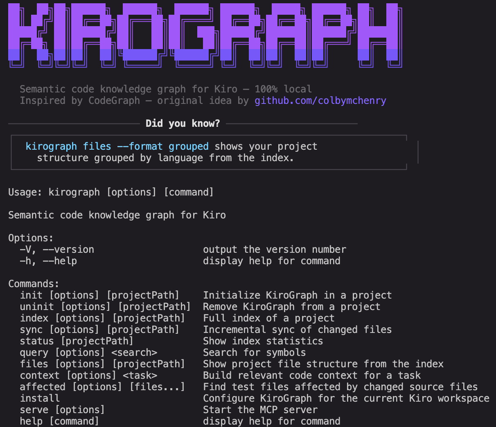

# KiroGraph



Semantic code knowledge graph for [Kiro](https://kiro.dev): fewer tool calls, instant symbol lookups, 100% local.

Inspired by [CodeGraph](https://github.com/colbymchenry/codegraph) by [colbymchenry](https://github.com/colbymchenry) for Claude Code, rebuilt natively for Kiro's MCP and Kiro hooks system.

## Why KiroGraph?

When you ask Kiro to work on a complex task, it explores your codebase using file reads, grep, and glob searches. Every one of those is a tool call, and tool calls consume context and slow things down.

KiroGraph gives Kiro a semantic knowledge graph that's pre-indexed and always up to date. Instead of scanning files to understand your code, Kiro queries the graph instantly: symbol relationships, call graphs, type hierarchies, impact radius, all in a single MCP tool call.

The result is fewer tool calls, less context used, and faster responses on complex tasks.

## What Gets Indexed?

KiroGraph uses [tree-sitter](https://tree-sitter.github.io/tree-sitter/) to parse your source files into an AST and extract:

- **Nodes**: functions, methods, classes, interfaces, types, enums, variables
- **Edges**: calls, imports, extends, implements, contains, decorates

Everything is stored in a local SQLite database (`.kirograph/kirograph.db`). **Nothing leaves your machine**. No API keys. No external services.

The index is kept fresh automatically via Kiro hooks that run `kirograph sync` whenever you save, create, or delete a source file.

## How It Works

KiroGraph pre-indexes your codebase into a local SQLite graph (symbols, call graphs, relationships). Instead of Kiro scanning files with grep/glob/read on every task, it queries the graph instantly via MCP tools.

```
┌─────────────────────────────────────────┐
│                  Kiro                   │
│                                         │
│  "Fix the auth bug"                     │
│           │                             │
│           ▼                             │
│  kirograph_context("auth bug")          │
│           │                             │
└───────────┼─────────────────────────────┘
            ▼
┌───────────────────────────────────────────┐
│         KiroGraph MCP Server              │
│  ┌──────────┐ ┌──────────┐ ┌──────────┐   │
│  │  search  │ │ callers  │ │ context  │   │
│  └────┬─────┘ └────┬─────┘ └────┬─────┘   │
│       └────────────┼────────────┘         │
│         SQLite Graph DB (.kirograph/)     │
└───────────────────────────────────────────┘
```

Kiro hooks keep the index fresh automatically on every file save, create, or delete with no background watcher process needed.

## Quick Start

```bash
npm install -g kirograph

# In your project:
kirograph install    # wires up MCP + hooks + steering in .kiro/
kirograph init -i    # creates .kirograph/ and indexes your code
```

Restart Kiro: it will now use KiroGraph tools automatically.

## Using with Kiro
kg install
kg init -i
kg status
kg context "fix auth bug"
```ograph init -i    # creates .kirograph/ and indexes your code
```

## Using with Kiro

`kirograph install` sets up three things in your Kiro workspace:

**`.kiro/settings/mcp.json`** — registers the MCP server so Kiro can call graph tools:
```json
{
  "mcpServers": {
    "kirograph": {
      "command": "kirograph",
      "args": ["serve", "--mcp"],
      "autoApprove": [
        "kirograph_search",
        "kirograph_context",
        "kirograph_callers",
        "kirograph_callees",
        "kirograph_impact",
        "kirograph_node",
        "kirograph_status"
      ]
    }
  }
}
```

**`.kiro/hooks/`** — three hooks for automatic index sync:

| Hook | Event | Action |
|------|-------|--------|
| `kirograph-sync-on-save.json` | `fileEdited` | `kirograph sync` |
| `kirograph-sync-on-create.json` | `fileCreated` | `kirograph sync` |
| `kirograph-sync-on-delete.json` | `fileDeleted` | `kirograph sync` |

These fire on source file changes (`.ts`, `.js`, `.py`, `.go`, `.rs`, `.java`, `.cs`, `.rb`, `.php`) and run an incremental sync — only re-parsing files whose content hash changed.

**`.kiro/steering/kirograph.md`** — teaches Kiro to use graph tools automatically when `.kirograph/` exists in the project. Kiro will:
- Start with `kirograph_context` for any task instead of scanning files
- Use `kirograph_search` instead of grep
- Use `kirograph_callers`/`kirograph_callees` to trace code flow
- Use `kirograph_impact` before making changes

## MCP Tools

| Tool | Use For |
|------|---------|
| `kirograph_context` | **Start here** — comprehensive context for a task in one call |
| `kirograph_search` | Find symbols by name (functions, classes, types) |
| `kirograph_callers` | What calls a function |
| `kirograph_callees` | What a function calls |
| `kirograph_impact` | What breaks if you change a symbol |
| `kirograph_node` | Symbol details + source code |
| `kirograph_status` | Index health and stats |

## CLI Reference

### Setup

```bash
kirograph install
```
Configure KiroGraph for the current Kiro workspace. Writes MCP config, hooks, and steering file into `.kiro/`.

### Project Management

```bash
kirograph init [path]        # Initialize .kirograph/ in a project
kirograph init -i            # Initialize and index immediately
kirograph uninit [path]      # Remove .kirograph/ from a project
kirograph uninit --force     # Skip confirmation prompt
```

### Indexing

```bash
kirograph index [path]       # Full index of the project
kirograph index --force      # Force re-index all files (ignore hash cache)
kirograph sync [path]        # Incremental sync of changed files
kirograph status [path]      # Show index stats (files, symbols, edges)
```

### Search & Exploration

```bash
kirograph query <term>               # Search for symbols by name
kirograph query <term> --kind class  # Filter by kind (function, method, class, interface...)
kirograph query <term> --limit 20    # Limit results
```

### File Structure

```bash
kirograph files [path]                    # Show indexed file tree
kirograph files --format flat             # Flat list of all files
kirograph files --format grouped          # Group files by language
kirograph files --filter src/components   # Filter by directory prefix
kirograph files --pattern "**/*.test.ts"  # Filter by glob pattern
kirograph files --max-depth 2             # Limit tree depth
kirograph files --no-metadata             # Hide language/symbol counts
kirograph files --json                    # Output as JSON
```

### Context Building

```bash
kirograph context "fix checkout bug"
kirograph context "add user authentication" --format json
kirograph context "refactor payment service" --max-nodes 30
kirograph context "validate token" --no-code
```

Extracts symbol tokens from the task description, finds relevant entry points in the graph, expands through callers/callees, and outputs structured markdown or JSON ready to paste into a prompt.

### Affected Tests

Find test files that depend on changed source files (useful in CI or pre-commit hooks)

```bash
kirograph affected src/utils.ts src/api.ts         # Pass files as arguments
git diff --name-only | kirograph affected --stdin   # Pipe from git diff
kirograph affected --stdin --json < changed.txt     # JSON output
kirograph affected src/auth.ts --filter "e2e/**"    # Custom test file pattern
kirograph affected src/lib.ts --depth 3 --quiet     # Paths only, shallow search
```

Options:

| Option | Description | Default |
|--------|-------------|---------|
| `--stdin` | Read file list from stdin (one per line) | false |
| `-d, --depth <n>` | Max dependency traversal depth | 5 |
| `-f, --filter <glob>` | Custom glob to identify test files | auto-detect |
| `-j, --json` | Output as JSON | false |
| `-q, --quiet` | Output file paths only | false |
| `-p, --path <path>` | Project path | cwd |

Example CI integration:
```bash
#!/usr/bin/env bash
AFFECTED=$(git diff --name-only HEAD | kirograph affected --stdin --quiet)
if [ -n "$AFFECTED" ]; then
  npx vitest run $AFFECTED
fi
```

### MCP Server

```bash
kirograph serve --mcp              # Start MCP server (used by Kiro)
kirograph serve --mcp --path /project  # Specify project path
```

## Supported Languages

TypeScript, JavaScript, TSX, JSX, Python, Go, Rust, Java, C, C++, C#, PHP, Ruby, Swift, Kotlin, Dart, Svelte

## Requirements

- Node.js >= 18
- Kiro IDE

## License

MIT
